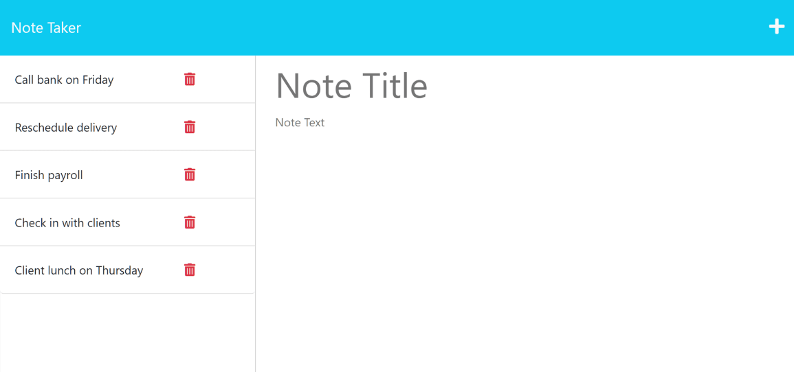
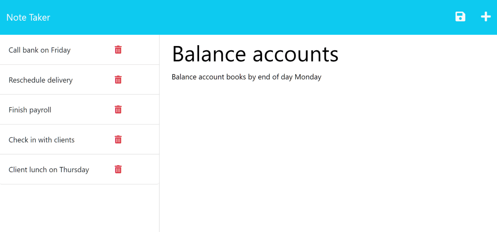

# Note Taker

  
   
  

  ## Description

  *The purpose, the motivation, the execution:*

  This project was developed to allow users to create and delete notes and serves as an organizational utility. 

  ## Table of Contents
  * [Installation](#installation)
  * [Usage](#usage)
  * [Contributions](#contributions)
  * [Tests](#tests)
  * [License](#license)
    
    ## Installation
    
    *Steps required to install project and how to get the development environment running:*
    
    

    You can clone the repository to you local hard drive or visit the link above to test out the project.
    
    ## Usage
    

    

    

    *Instructions and examples for use:*
    
    The user can add a new note as it will be able to be saved if it includes a title and text after clicking the icon on the top right. Then the user can delete a note if they click on the red icon within the notes list. 
    
    ## License
    
    This project is covered under the MIT License license.
  ---

  ## Questions? 

  

  For any questions or concerns, feel free to contact me using the information below:
  
  GitHub: [@dpprdgls](https://api.github.com/users/dpprdgls)

  